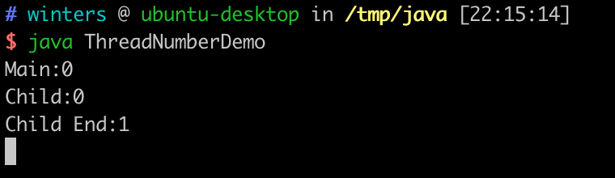
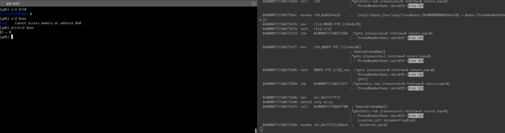
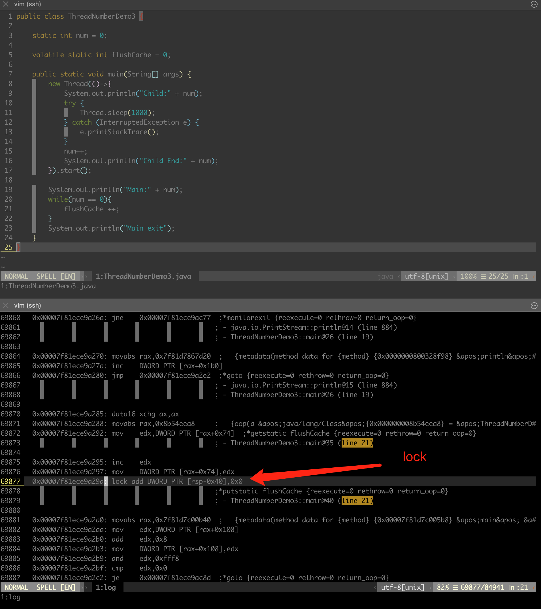

# JMM在X86下的原理与实现

## Java的happen-before模型

* 众所周知 Java有一个happen-before模型，可以帮助程序员隔离各个平台多线程并发的复杂性，只要Java程序员遵守happen-before模型就不用担心多线程内存排序或者缓存可见性的问题

* 摘自周志明老师的JMM章节

>  程序次序规则（Program Order Rule）：在一个线程内，按照控制流顺序，书写在前面的操作先行 发生于书写在后面的操作。注意，这里说的是控制流顺序而不是程序代码顺序，因为要考虑分支、循 环等结构。

>  管程锁定规则（Monitor Lock Rule）：一个unlock操作先行发生于后面对同一个锁的lock操作。这 里必须强调的是“同一个锁”，而“后面”是指时间上的先后。

>  volatile变量规则（Volatile Variable Rule）：对一个volatile变量的写操作先行发生于后面对这个变量 的读操作，这里的“后面”同样是指时间上的先后。 

>  线程启动规则（Thread Start Rule）：Thread对象的start()方法先行发生于此线程的每一个动作。 

>  线程终止规则（Thread Termination Rule）：线程中的所有操作都先行发生于对此线程的终止检 测，我们可以通过Thread::join()方法是否结束、Thread::isAlive()的返回值等手段检测线程是否已经终止 执行。

>  线程中断规则（Thread Interruption Rule）：对线程interrupt()方法的调用先行发生于被中断线程 的代码检测到中断事件的发生，可以通过Thread::interrupted()方法检测到是否有中断发生。

>  对象终结规则（Finalizer Rule）：一个对象的初始化完成（构造函数执行结束）先行发生于它的 finalize()方法的开始。

>  传递性（Transitivity）：如果操作A先行发生于操作B，操作B先行发生于操作C，那就可以得出 操作A先行发生于操作C的结论。


## 一个来自技术交流群里的提问

```text
笔者的测试环境
openjdk 11.0.9.1 2020-11-04
OpenJDK Runtime Environment (build 11.0.9.1+1-Ubuntu-0ubuntu1.20.04)
OpenJDK 64-Bit Server VM (build 11.0.9.1+1-Ubuntu-0ubuntu1.20.04, mixed mode, sharing)
```

* DEMO1 死循环


```java
public class ThreadNumberDemo {

    static int num = 0;

    public static void main(String[] args) {
        new Thread(()->{
            System.out.println("Child:" + num);
            try {
                Thread.sleep(1000);
            } catch (InterruptedException e) {
                e.printStackTrace();
            }
            num++;
            System.out.println("Child End:" + num);
        }).start();

        System.out.println("Main:" + num);
        while(num == 0){
        }
        System.out.println("Main exit");
    }
}
```

* DEMO2 退出循环

```java
import java.util.concurrent.atomic.AtomicInteger;

public class ThreadNumberDemo2 {

    static int num = 0;

    static AtomicInteger flushCache = new AtomicInteger(0);

    public static void main(String[] args) {
        new Thread(()->{
            System.out.println("Child:" + num);
            try {
                Thread.sleep(1000);
            } catch (InterruptedException e) {
                e.printStackTrace();
            }
            num++;
            System.out.println("Child End:" + num);
        }).start();
        System.out.println("Main:" + num);
        while(num == 0){
            flushCache.getAndAdd(1) ;
        }
        System.out.println("Main exit");
    }
}
```


* DEMO3 退出循环

```java
public class ThreadNumberDemo3 {

    static int num = 0;

    volatile static int flushCache = 0;

    public static void main(String[] args) {
        new Thread(()->{
            System.out.println("Child:" + num);
            try {
                Thread.sleep(1000);
            } catch (InterruptedException e) {
                e.printStackTrace();
            }
            num++;
            System.out.println("Child End:" + num);
        }).start();

        System.out.println("Main:" + num);
        while(num == 0){
            flushCache ++;
        }
        System.out.println("Main exit");
    }
}
```

* 笔者为什么不按常理出牌直接在DEMO1的基础上给num加上volatile?

* 如果在num变量上加上volatile 则满足了 周志明老师所介绍的 HappenBefore 规则3，而对原子变量跟volatile变量flushCache的操作并不满足任何所谓的happen-before情况，因为在DEMO2 DEMO3整个程序只有主线程访问了flushCache这个变量

>  volatile变量规则（Volatile Variable Rule）：对一个volatile变量的写操作先行发生于后面对这个变量 的读操作，这里的“后面”同样是指时间上的先后。 


## Volatile与原子变量的原理

### 反编译与调试
* 笔者凭着好奇心决定尝试反编译看看源码

笔者的Linux跟JDK环境

```text
Distributor ID:	Ubuntu
Description:	Ubuntu 20.04.1 LTS
Release:	20.04
Codename:	focal

openjdk 11.0.9.1 2020-11-04
OpenJDK Runtime Environment (build 11.0.9.1+1-Ubuntu-0ubuntu1.20.04)
OpenJDK 64-Bit Server VM (build 11.0.9.1+1-Ubuntu-0ubuntu1.20.04, mixed mode, sharing)
```

* 读者如果想亲自动手实验 请按照下面两个教程 将hsdis-amd64.so放到对应的JDK目录下
> https://juejin.cn/post/6844903656806940686
> https://github.com/liuzhengyang/hsdis

* 请读者注意，每次启动的Java进程内存地址都会变化，下面所有的地址都是笔者调试时的地址，
读者要根据自己生成的信息 自行更改汇编代码的地址

* 步骤1 编译java文件
```bash 
javac ThreadNumberDemo.java
```
得到ThreadNumberDemo.class文件

* 步骤2 执行如下命令
```bash
java ThreadNumberDemo
```

* 步骤3 观察


此时程序并未退出，如下图中 占用笔者大量CPU资源


* 步骤4 使用反编译插件 + GDB调试
退出刚才的Java进程，执行如下命令

```bash
java -XX:+UnlockDiagnosticVMOptions -XX:+TraceClassLoading -XX:+LogCompilation 
-XX:LogFile=/tmp/log -XX:+PrintAssembly -XX:PrintAssemblyOptions=intel 
-XX:-BackgroundCompilation -XX:+UnlockDiagnosticVMOptions ThreadNumberDemo
```

* 步骤5 观察/tmp/log文件 查看反编译生成的文件信息 当看到main函数相关的汇编代码以及注释生成后 执行如下命令

```bash
sudo gdb -p {pid}
```
上面的{pid} 请读者以自己机器上运行的Java进程pid为准，笔者这里前面展示的图片中有两个Java进程的pid，读者可以分别用gdb attach上去尝试调试

* 步骤6 附加后 查看/tmp/log 以及Java源文件


附加java进程后直接跳过  


GDB 执行
```bash 
set disassembly-flavor intel
```

* 步骤7 反编译对比 /tmp/log

GDB 执行
```bash 
disass 0x00007f27a0371b7f,0x00007f27a0371b89
```
读者需要自行根据 /tmp/log文件中的信息 决定 disass 后面两个地址，注意中间有一个 ```,```符号


* 步骤8 设置breakpoint 跟进代码

```bash
break *0x00007f27a0371b7f
break *0x00007f27a0371b86
break *0x00007f27a0371b89
```

接下来使用c调试 发现死循环如下图


通过GDB 可以看到r10寄存器内的指针指向的内存地址存储的变量为0 eax寄存器中存储的值同样为0


通过上图笔者猜测，主线程并没有观测到main函数创建的子线程对num的写操作，从r10指针 ```0x7f27b7848000``` (num变量的地址) 来看num，
几次循环下来均为0，是导致主线程不断循环的原因占用CPU的原因

* 步骤9 笔者通过GDB 如下设置PC指针跳出循环 验证程序正常退出 如下图
```bash 
set var $pc=0x00007f27a0371b8b
```


* DEMO1小结 死循环的根本原因在于主线程无法观测到子线程对num的更新的值，据笔者推测是多线程缓存可见性的问题

* DEMO2 如下图


* DEMO3 如下图



### 总结
DEMO2 DEMO3 反汇编后均找到lock指令，基本上可以判断JVM在X64机器上对原子变量跟volatile的实现都使用了汇编lock指令的语义，
根据笔者在Stack Overflow上的一些资料浏览得出结论--lock具有内存栅栏的功能，能解决DEMO1(num变量)内存不可见的问题，
另外DEMO2 DEMO3均未使用Happen-Before模型。
